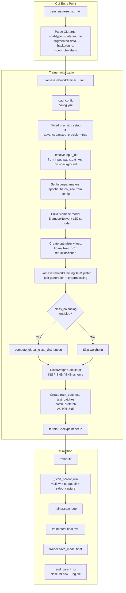
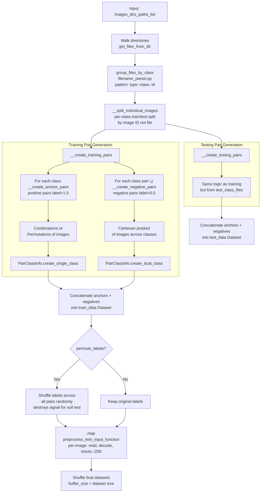
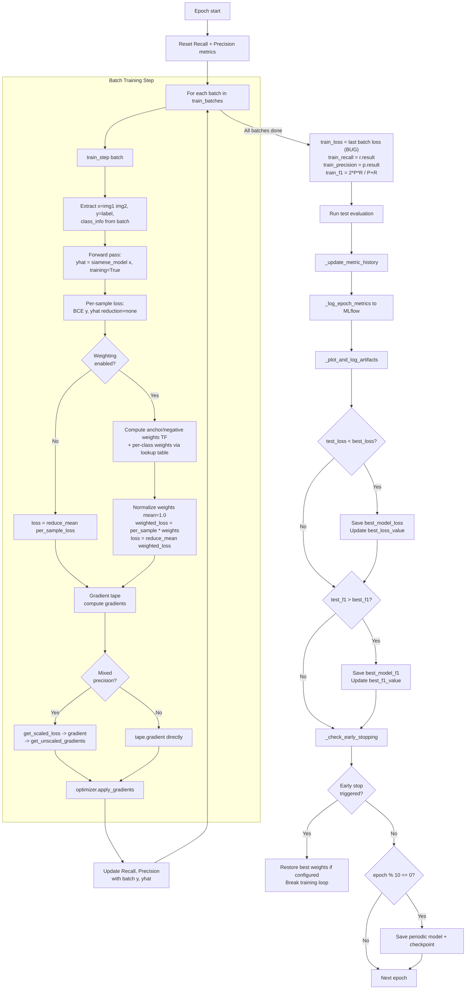
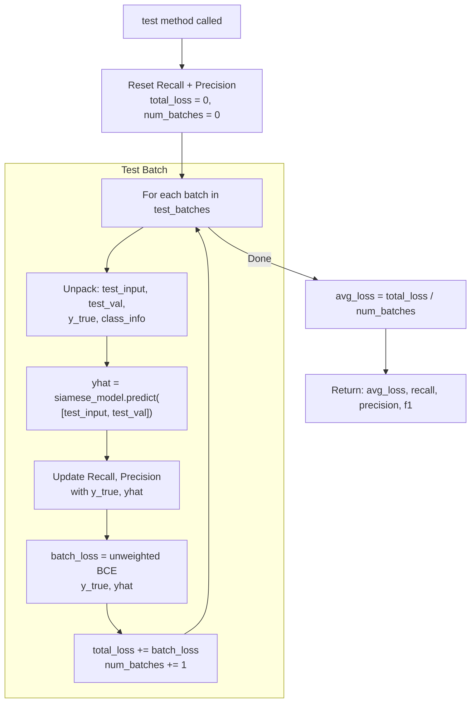
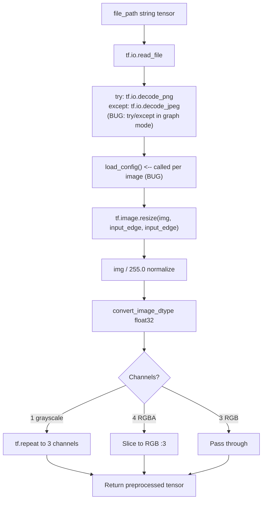
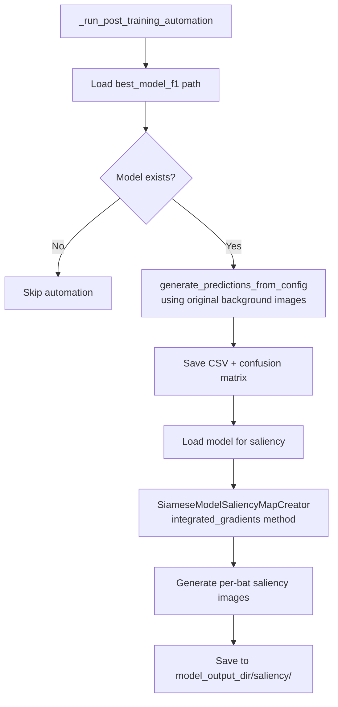
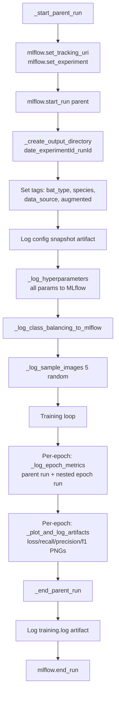

# Siamese Network Training Pipeline -- Flow Diagram

> Generated: 2026-04-10  
> Source: `app/siamese_training/trainer.py`, `app/siamese_core/network.py`, `app/siamese_data/data_splitter.py`

---

## 1. Top-Level Training Flow

This diagram covers the entire lifecycle from CLI invocation through model save.

---

## 2. Data Loading and Pair Generation Flow

This covers `SiameseNetworkTrainingDataSplitter.__init__` in detail.

---

## 3. Training Loop Flow (per epoch)

---

## 4. Test Evaluation Flow

---

## 5. Image Preprocessing Flow (per image inside tf.data.map)

---

## 6. Post-Training Automation Flow

---

## 7. MLflow Lifecycle Flow

