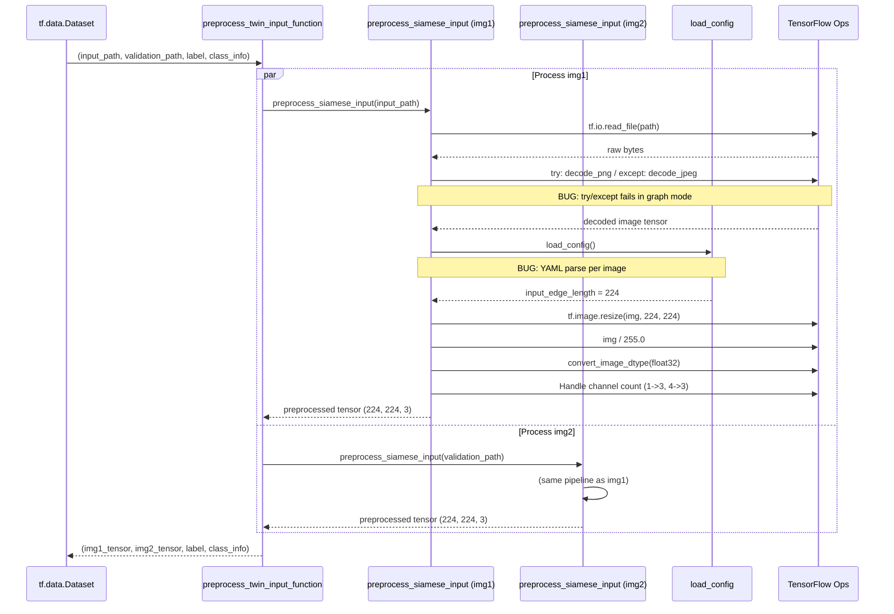
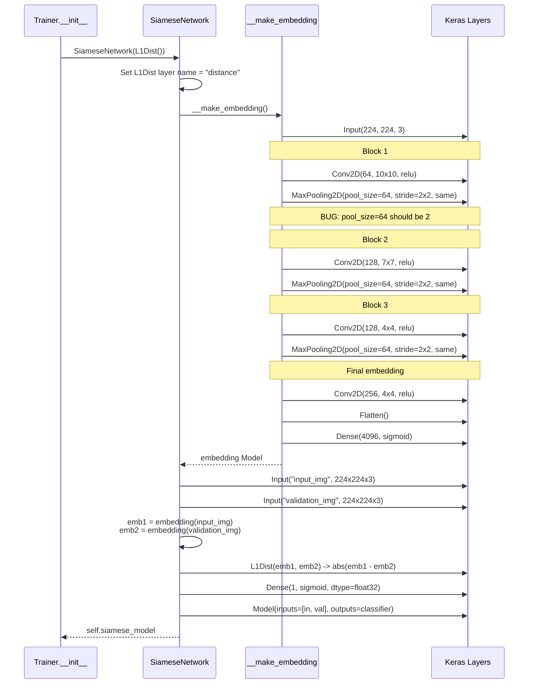
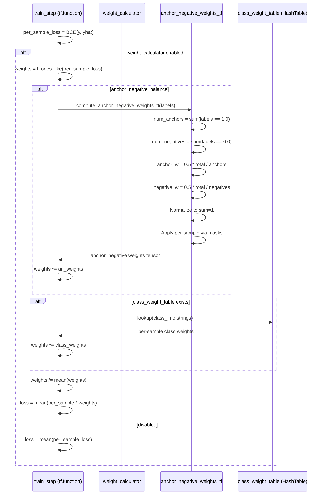

# Siamese Network Training Pipeline -- Sequence Diagrams

> Generated: 2026-04-10  
> Source: Full codebase trace from CLI to model save

---

## 1. Full Training Run Sequence

```mermaid
sequenceDiagram
    actor User
    participant CLI as train_siamese.py
    participant Trainer as SiameseNetworkTrainer
    participant Config as config/loader.py
    participant Network as SiameseNetwork
    participant Splitter as DataSplitter
    participant Weights as ClassWeightCalculator
    participant MLflow as MLflow
    participant TF as TensorFlow

    User->>CLI: python -m app.siamese_training.train_siamese<br/>--bat-type m --data-source video
    CLI->>CLI: argparse: bat_type, data_source,<br/>augmented_data, background, permute_labels

    rect rgb(40, 40, 80)
        Note over CLI,TF: Initialization Phase
        CLI->>Trainer: SiameseNetworkTrainer(bat_type, augmented_data,<br/>data_source, background)
        Trainer->>Config: load_config()
        Config-->>Trainer: config from config.yml
        
        Trainer->>TF: mixed_precision Policy setup (if enabled)
        
        Trainer->>Network: SiameseNetwork(L1Dist())
        Network->>Network: __make_embedding()<br/>Conv2D(64)->MaxPool->Conv2D(128)->MaxPool<br/>->Conv2D(128)->MaxPool->Conv2D(256)<br/>->Flatten->Dense(4096,sigmoid)
        Network->>Network: build_model()<br/>twin inputs -> shared embedding -> L1Dist -> Dense(1,sigmoid)
        Network-->>Trainer: self.siamese_model = model
        
        Trainer->>Trainer: Create optimizer (Adam 1e-4)<br/>Wrap with LossScaleOptimizer if mixed precision
        Trainer->>Trainer: Create loss functions<br/>train: BCE(reduction=none)<br/>test: BCE(default reduction)
    end

    rect rgb(40, 80, 40)
        Note over Trainer,Splitter: Data Loading Phase
        Trainer->>Splitter: SiameseNetworkTrainingDataSplitter(<br/>[input_dir], training_portion, mode, permute_labels)
        Splitter->>Splitter: Walk directories, collect all files
        Splitter->>Splitter: group_files_by_class(filenames)<br/>pattern: type--class--id[--aug###]
        Splitter->>Splitter: __split_individual_images()<br/>per-class 70/30 by image ID
        Splitter->>Splitter: __create_training_pairs()<br/>positive: combinations/permutations<br/>negative: cartesian product across classes
        Splitter->>Splitter: __create_testing_pairs()<br/>same logic from test split
        Splitter->>Splitter: __permute_combined_labels()<br/>(only if permute_labels=true)
        Splitter->>TF: .map(preprocess_twin_input_function)<br/>read, decode, resize, normalize per image
        Splitter->>Splitter: __shuffle_final_datasets()
        Splitter-->>Trainer: train_data, test_data (tf.data.Dataset)
    end

    rect rgb(80, 60, 40)
        Note over Trainer,Weights: Class Balancing Phase
        Trainer->>Trainer: compute_global_class_distribution<br/>(if per_class_balance=true)
        Trainer->>Weights: ClassWeightCalculator(config, global_dist)
        Weights->>Weights: Validate config, store distribution
        Weights->>Weights: create_weight_lookup_table()<br/>TF StaticHashTable for O(1) lookups
        Weights-->>Trainer: self.weight_calculator, self.class_weight_table
    end

    Trainer->>Trainer: .batch(batch_size).prefetch(AUTOTUNE)<br/>for train and test
    Trainer->>TF: tf.train.Checkpoint(opt, model)
    Trainer-->>CLI: Trainer initialized

    rect rgb(80, 40, 40)
        Note over CLI,MLflow: Training Execution Phase
        CLI->>Trainer: trainer.fit(bat_type, augmented_data, data_source)
        Trainer->>Trainer: _start_parent_run()
        Trainer->>MLflow: set_tracking_uri, set_experiment
        Trainer->>MLflow: start_run(run_name)
        Trainer->>Trainer: _create_output_directory()<br/>date_experimentId_runId
        Trainer->>MLflow: set_tag(), log_params(), log_artifact(config)
        Trainer->>Trainer: Start stdout TeeStream capture
        
        Trainer->>Trainer: trainer.train()
    end
```



---

## 2. Training Loop Sequence (per epoch)

```mermaid
sequenceDiagram
    participant Trainer as Trainer.train()
    participant Model as siamese_model
    participant Loss as BCE Loss
    participant Weights as WeightCalculator
    participant Opt as Optimizer
    participant Metrics as Recall/Precision
    participant MLflow as MLflow

    loop Epoch 1..num_epochs
        Trainer->>Trainer: Reset Recall(), Precision()
        
        loop Each batch in train_batches
            Trainer->>Trainer: train_step(batch)
            
            Note over Trainer,Model: Inside GradientTape
            Trainer->>Model: yhat = model([img1, img2], training=True)
            Model-->>Trainer: yhat (predictions)
            
            Trainer->>Loss: per_sample_loss = BCE(y, yhat, reduction=none)
            Loss-->>Trainer: per-sample losses
            
            alt Weighting enabled
                Trainer->>Trainer: anchor_neg_weights = _compute_anchor_negative_weights_tf(y)
                Trainer->>Trainer: class_weights = class_weight_table.lookup(class_info)
                Trainer->>Trainer: weights = an_weights * class_weights<br/>normalize to mean=1.0
                Trainer->>Trainer: loss = mean(per_sample_loss * weights)
            else No weighting
                Trainer->>Trainer: loss = mean(per_sample_loss)
            end
            
            Note over Trainer,Opt: Gradient computation
            alt Mixed precision
                Trainer->>Opt: scaled_loss = get_scaled_loss(loss)
                Trainer->>Opt: scaled_grad = tape.gradient(scaled_loss, vars)
                Trainer->>Opt: grad = get_unscaled_gradients(scaled_grad)
            else Standard
                Trainer->>Opt: grad = tape.gradient(loss, vars)
            end
            
            Trainer->>Opt: apply_gradients(zip(grad, vars))
            Trainer->>Metrics: r.update_state(y, yhat)<br/>p.update_state(y, yhat)
        end

        Note over Trainer: BUG: train_loss = last batch only
        Trainer->>Trainer: train_loss = loss (LAST batch)<br/>train_recall = r.result()<br/>train_precision = p.result()<br/>train_f1 = 2*P*R/(P+R)

        Trainer->>Trainer: test() -> test_loss, test_recall, test_precision, test_f1

        Trainer->>MLflow: _log_epoch_metrics(epoch, train, test)<br/>parent run + nested epoch run
        Trainer->>MLflow: _plot_and_log_artifacts(epoch)<br/>loss/recall/precision/f1 PNG plots

        alt test_loss < best_loss
            Trainer->>Trainer: save_model("best_model_loss")
            Trainer->>MLflow: log_metric("best_test_loss")
        end
        alt test_f1 > best_f1
            Trainer->>Trainer: save_model("best_model_f1")
            Trainer->>MLflow: log_metric("best_test_f1")
        end

        alt Early stopping triggered
            Trainer->>Trainer: Load best_model_f1 weights
            Note over Trainer: Break training loop
        end
    end

    Trainer->>Trainer: _run_post_training_automation()<br/>predictions + saliency maps
    Trainer->>Trainer: _end_parent_run()
    Trainer->>MLflow: log_artifact(training.log)<br/>end_run()
```

---

## 3. Data Preprocessing Sequence (per image pair in tf.data.map)



---

## 4. Model Architecture Build Sequence



---

## 5. Class Weight Computation Sequence (train_step)



---

## 6. Post-Training Automation Sequence

```mermaid
sequenceDiagram
    participant Trainer as Trainer
    participant GenPred as generate_predictions
    participant Saliency as SaliencyMapCreator
    participant TF as TensorFlow

    Trainer->>Trainer: _run_post_training_automation()
    Trainer->>Trainer: best_model_path = model_output_dir/best_model_f1

    rect rgb(40, 60, 40)
        Note over Trainer,GenPred: Prediction Generation
        Trainer->>GenPred: generate_predictions_from_config(<br/>model_path, output_dir, bat_type,<br/>source, background="original")
        GenPred->>TF: Load model with custom L1Dist
        GenPred->>GenPred: Build pairs from original_bg_input
        GenPred->>TF: model.predict() on all pairs
        GenPred->>GenPred: Compute metrics, confusion matrix
        GenPred-->>Trainer: csv_path, plot_path
    end

    rect rgb(60, 40, 60)
        Note over Trainer,Saliency: Saliency Map Generation
        Trainer->>TF: Load model for saliency
        Trainer->>Saliency: SiameseModelSaliencyMapCreator(<br/>model, original_bg_input,<br/>saliency_output, sample_size=25)
        Saliency->>Saliency: generate_per_bat_saliency_images(<br/>method="integrated_gradients",<br/>smoothing=true)
        Saliency-->>Trainer: output_files list
    end
```


