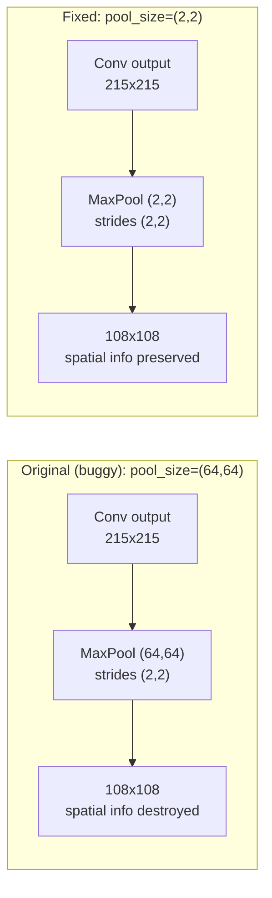
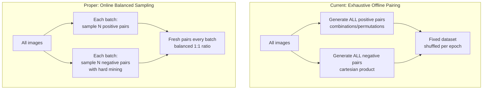

# Current Implementation vs. Proper Siamese Network Design

> Generated: 2026-04-10 (updated 2026-04-11 after paper review and figure analysis)  
> References: Koch et al. (2015) "Siamese Neural Networks for One-shot Image Recognition" (paper read in full), Chopra et al. 2005, Schroff et al. 2015 (FaceNet), modern best practices

---

## 1. Architecture Comparison

### Embedding Network

| Aspect | Original Code (before fix) | Koch et al. 2015 (Paper) | Modern Best Practice |
|--------|----------------------|----------------------------|---------------------|
| **Conv Block 1** | Conv2D(64, 10x10, relu) + MaxPool(**64**, 2x2) | Conv2D(64, 10x10, relu) + MaxPool(**(2,2)**) | Conv2D(64, 3x3, relu) + BatchNorm + MaxPool((2,2)) |
| **Conv Block 2** | Conv2D(128, 7x7, relu) + MaxPool(**64**, 2x2) | Conv2D(128, 7x7, relu) + MaxPool(**(2,2)**) | Conv2D(128, 3x3, relu) + BatchNorm + MaxPool((2,2)) |
| **Conv Block 3** | Conv2D(128, 4x4, relu) + MaxPool(**64**, 2x2) | Conv2D(128, 4x4, relu) + MaxPool(**(2,2)**) | Conv2D(256, 3x3, relu) + BatchNorm + MaxPool((2,2)) |
| **Conv Block 4** | Conv2D(256, 4x4, relu) | Conv2D(256, 4x4, relu) | Conv2D(512, 3x3, relu) + BatchNorm |
| **Embedding** | Flatten + Dense(4096, **sigmoid**) | Flatten + Dense(4096, **sigmoid**) | GlobalAvgPool + Dense(128/256, **relu** or linear) + L2-normalize |
| **Regularization** | None | **Per-layer L2** (lambda in [0, 0.1]) | BatchNorm + Dropout(0.5) + weight decay |
| **Pool sizes** | **64x64 (BUG -- FIXED 2026-04-11)** | (2,2) -- paper: "filter size and stride of 2" | (2,2) |
| **Kernel sizes** | 10x10, 7x7, 4x4, 4x4 | 10x10, 7x7, 4x4, 4x4 | 3x3 throughout (VGG-style) or residual blocks |
| **Parameters** | ~463M | ~463M (same arch, correct pooling doesn't change param count) | ~1-25M (backbone dependent) |

**Root cause of pool_size=64 bug:** Paper Figure 4 labels max-pooling as "64 @ 2x2", where "64" is the output channel count (not a parameter). The figure also has a copy-paste error: pools 2 and 3 should say "128 @ 2x2" but repeat "64". Developer misread the figure notation as a `MaxPooling2D` argument.

### Twin Model

| Aspect | Current Implementation | Koch et al. 2015 | Modern Best Practice |
|--------|----------------------|-------------------|---------------------|
| **Weight sharing** | Shared embedding (correct) | Shared embedding | Shared embedding (or pretrained backbone) |
| **Distance** | L1 (absolute difference) | L1 (absolute difference) | L2, cosine, or learned metric |
| **Classifier** | Dense(1, sigmoid) | Dense(1, sigmoid) | Direct distance thresholding or Dense(1, sigmoid) |
| **Loss** | BinaryCrossentropy | BinaryCrossentropy (implied) | Contrastive, Triplet, ArcFace, or BCE |

---

## 2. Data Pipeline Comparison

### Pair Generation

| Aspect | Current Implementation | Proper Siamese Practice |
|--------|----------------------|------------------------|
| **Positive pairs** | All combinations/permutations within class (offline, exhaustive) | **Random same/different pairs** (paper: "sampling random same and different pairs") | Online sampling per batch or balanced offline |
| **Negative pairs** | Cartesian product across all class pairs (offline, exhaustive) | Random different pairs | Hard negative mining or random sampling |
| **Ratio** | ~9:1 negative:positive (with 10 classes, 25 samples) | **Balanced** ("uniform number of training examples per alphabet") | 1:1 or 2:1 negative:positive |
| **Pair selection** | Random (no difficulty awareness) | Random | Curriculum: easy -> hard negatives |
| **Dataset size** | All possible pairs (can be very large) | **Fixed size**: 30k, 90k, or 150k pairs | Limit total pairs or use mining |
| **Augmentation** | None during training (offline only) | **Online affine distortions** (8x augmentation) | Online augmentation (flip, crop, color jitter) |

### Preprocessing

| Aspect | Current Implementation | Proper Practice |
|--------|----------------------|----------------|
| **Image loading** | try/except decode_png/jpeg (graph-mode bug) | `tf.io.decode_image()` |
| **Config loading** | `load_config()` per image (performance bug) | Read once, pass as closure or constant |
| **Normalization** | /255.0 to [0,1] | /255.0 or ImageNet mean/std normalization |
| **Augmentation** | None during training (offline only) | Online augmentation (random flip, crop, color jitter) |
| **Channel handling** | Grayscale->RGB, RGBA->RGB | Pre-validate dataset; `decode_image(channels=3)` |
| **Error handling** | Silent black image fallback | Fail loud or skip with logging |

---

## 3. Training Loop Comparison

### Loss and Optimization

| Aspect | Current Implementation | Koch et al. 2015 | Modern Practice |
|--------|----------------------|-------------------|-----------------|
| **Loss** | BCE (reduction=none, weighted) | **Regularized BCE** (+ lambda * \|w\|^2) | Contrastive loss, Triplet loss, or BCE |
| **Weighting** | Anchor/negative + per-class (INS/ISNS/ENS) | Equal representation per alphabet | Online hard example mining (OHEM) |
| **Optimizer** | Adam(1e-4), config says 5e-5 | **SGD with per-layer momentum** (mu starts 0.5, increases linearly) | Adam or AdamW with cosine LR schedule |
| **LR schedule** | **Fixed** (no decay) | **0.99x per epoch** (1% decay) | Cosine annealing, warmup, or ReduceLROnPlateau |
| **L2 regularization** | **None** | **Per-layer lambda_j in [0, 0.1]** | Weight decay in AdamW |
| **Weight init** | **Keras defaults** | Conv: N(0, 0.01), bias: N(0.5, 0.01), FC: N(0, 0.2) | He/Xavier initialization |
| **Batch size** | 32 (config) | **128** | 32-256 depending on GPU memory |
| **Max epochs** | 80 | **200** (with early stopping patience=20) | Variable with early stopping |
| **Gradient clipping** | Configured but disabled | Not mentioned | Enabled (clip_norm=1.0) |

### Metrics and Monitoring

| Aspect | Current Implementation | Proper Practice |
|--------|----------------------|----------------|
| **Train loss** | Last batch only (**BUG**) | Epoch average (accumulate across batches) |
| **Metrics** | Precision, Recall, F1 | Precision, Recall, F1 + ROC-AUC + EER |
| **Threshold** | Default 0.5 (implicit in Precision/Recall) | Optimized threshold from ROC curve |
| **Monitoring** | MLflow logging (correct) | MLflow/TensorBoard + gradient histograms |
| **Visualization** | Loss/metric plots per epoch | + embedding visualizations (t-SNE/UMAP) |

### Checkpointing and Early Stopping

| Aspect | Current Implementation | Proper Practice |
|--------|----------------------|----------------|
| **Best model** | By test_loss AND test_f1 (both saved) | By validation metric (F1 or EER) |
| **Early stopping** | On F1, patience=5 | On validation metric, patience=10-20 |
| **Restore best** | Loads from disk (correct) | Loads from disk or in-memory copy |
| **Periodic save** | Every 10 epochs | Every N epochs + best only |

---

## 4. Critical Differences -- Impact Analysis

### 4.1 MaxPooling Bug vs. Koch et al. -- FIXED 2026-04-11



The spatial dimensions are identical (108x108) because strides determine output size. But the **content** is radically different:
- **pool_size=(2,2)**: Each output pixel represents the max of 4 adjacent input pixels. Local features (edges, corners, textures) are preserved.
- **pool_size=(64,64)**: Each output pixel represents the max of 4,096 input pixels. Only the single brightest value in a huge region survives. All local structure is erased.

**Root cause:** Paper Figure 4 labels max-pooling as "64 @ 2x2". The "64" is the output channel count (matching the preceding conv), not a pooling parameter. The figure also has a copy-paste error where pools 2 and 3 show "64" instead of "128". The paper text is unambiguous: *"max-pooling with a filter size and stride of 2"*.

This was the single most impactful bug. It meant the network **could not perform face recognition** -- it could only perform coarse color-based matching.

### 4.2 Sigmoid Embedding vs. Modern ReLU

```
Sigmoid embedding: all values in [0, 1]
    L1 distance range: [0.0, 4096.0]
    Gradient at saturation: ~0 (vanishing)
    Information per dim: limited by [0,1] compression

ReLU embedding: values in [0, +inf)
    L1 distance range: [0.0, +inf)
    Gradient: 1 for positive values (healthy)
    Information per dim: unbounded positive range

ReLU + L2-normalize: unit sphere
    Cosine similarity range: [-1, 1]
    Gradient: well-conditioned
    Information per dim: direction-based, not magnitude-based
```

### 4.3 Data Pair Strategy



---

## 5. Recommended Fix Priority

### Phase 1: Critical Fixes (bugs -- deviations from paper)

1. ~~**Fix MaxPooling2D pool_size=64 -> (2,2)**~~ -- **FIXED 2026-04-11**
   - File: `app/siamese_core/network.py` lines 58, 62, 66
   - Root cause: developer misread paper Figure 4 notation "64 @ 2x2"
   - All layer calls now use explicit named parameters
   
2. **Fix train_loss accumulation** -- average across all batches
   - File: `app/siamese_training/trainer.py` line 840-860
   - Impact: Correct loss monitoring

3. **Fix image decoding** -- use `tf.io.decode_image()`
   - File: `app/siamese_data/data_splitter.py` lines 30-33
   - Impact: Robust image loading in graph mode

4. **Fix config loading** -- read once, not per-image
   - File: `app/siamese_data/data_splitter.py` line 36
   - Impact: Major performance improvement

### Phase 2: Align with Paper's Training Procedure

5. **Add L2 regularization** per layer -- paper uses lambda_j in [0, 0.1]
6. **Add LR schedule** -- paper decays 0.99x per epoch
7. **Add proper weight initialization** -- paper specifies N(0, 0.01) for conv, N(0, 0.2) for FC
8. **Keep sigmoid embedding** -- this is correct per the paper, do NOT change it as a "fix"

### Phase 3: Training Pipeline Improvements (beyond the paper)

9. **Balance positive/negative pair counts** (limit negatives or oversample positives)
10. **Add online data augmentation** (paper uses affine distortions, 8x augmentation)
11. **Replace model.predict() with model()** in test loop
12. **Add embedding visualization** (t-SNE/UMAP of test embeddings per epoch)
13. **Remove nested MLflow runs** per epoch

### Phase 4: Optional Modern Upgrades (NOT paper-faithful, test separately)

14. **Experiment with ReLU embedding** (instead of sigmoid) -- modern practice but NOT what the paper specifies
15. **Add BatchNormalization** after each Conv2D -- not in the paper but helps with deeper training
16. **Add Dropout(0.5)** before the embedding Dense layer -- not in the paper

---

## 6. Reference Architecture (Koch et al. 2015 -- Corrected)

For reference, this is the architecture as described in the original paper, implemented correctly:

```python
def make_embedding(input_shape=(224, 224, 3)):
    inp = Input(shape=input_shape)

    # Block 1: 64 filters, 10x10
    x = Conv2D(filters=64, kernel_size=(10, 10), activation="relu")(inp)
    x = MaxPooling2D(pool_size=(2, 2), strides=(2, 2))(x)

    # Block 2: 128 filters, 7x7
    x = Conv2D(filters=128, kernel_size=(7, 7), activation="relu")(x)
    x = MaxPooling2D(pool_size=(2, 2), strides=(2, 2))(x)

    # Block 3: 128 filters, 4x4
    x = Conv2D(filters=128, kernel_size=(4, 4), activation="relu")(x)
    x = MaxPooling2D(pool_size=(2, 2), strides=(2, 2))(x)

    # Block 4: 256 filters, 4x4
    x = Conv2D(filters=256, kernel_size=(4, 4), activation="relu")(x)

    # Embedding
    x = Flatten()(x)
    x = Dense(units=4096, activation="sigmoid")(x)  # Paper uses sigmoid

    return Model(inputs=inp, outputs=x, name="embedding")
```

### Modern Enhancement of Koch et al.

```python
def make_embedding_modern(input_shape=(224, 224, 3)):
    inp = Input(shape=input_shape)

    # Block 1
    x = Conv2D(filters=64, kernel_size=(10, 10), activation="relu", padding="valid")(inp)
    x = BatchNormalization()(x)
    x = MaxPooling2D(pool_size=(2, 2), strides=(2, 2))(x)

    # Block 2
    x = Conv2D(filters=128, kernel_size=(7, 7), activation="relu", padding="valid")(x)
    x = BatchNormalization()(x)
    x = MaxPooling2D(pool_size=(2, 2), strides=(2, 2))(x)

    # Block 3
    x = Conv2D(filters=128, kernel_size=(4, 4), activation="relu", padding="valid")(x)
    x = BatchNormalization()(x)
    x = MaxPooling2D(pool_size=(2, 2), strides=(2, 2))(x)

    # Block 4
    x = Conv2D(filters=256, kernel_size=(4, 4), activation="relu", padding="valid")(x)
    x = BatchNormalization()(x)

    # Embedding with regularization
    x = Flatten()(x)
    x = Dropout(0.5)(x)
    x = Dense(units=4096, activation="relu")(x)  # ReLU instead of sigmoid

    return Model(inputs=inp, outputs=x, name="embedding")
```

---

## 7. What the Network Is Actually Learning (Current State)

Given the MaxPooling2D bug, the current network is effectively:

```
Input (224x224x3)
    |
    v
Conv2D 64 filters (extracts local features from 10x10 patches)
    |
    v
MaxPool 64x64 window (DESTROYS local features, keeps only regional max)
    |
    v
Conv2D 128 filters (tries to learn from already-destroyed features)
    |
    v
MaxPool 64x64 window (further destruction)
    |
    v
Conv2D 128 filters (learning from global-max summaries)
    |
    v
MaxPool 64x64 window (more destruction)
    |
    v
Conv2D 256 filters (coarse global patterns only)
    |
    v
Dense 4096 sigmoid (memorizes color/brightness patterns)
    |
    v
L1 Distance + Dense(1) sigmoid
    |
    v
"Are these two images similar in overall color?"  (NOT "same individual?")
```

After fixing:

```
Input (224x224x3)
    |
    v
Conv2D 64 filters (local features: edges, textures at 10x10 scale)
    |
    v
MaxPool 2x2 (gentle downsampling, features preserved)
    |
    v
Conv2D 128 filters (mid-level features: eye shapes, ear contours)
    |
    v
MaxPool 2x2 (gentle downsampling)
    |
    v
Conv2D 128 filters (higher-level features: face structure, proportions)
    |
    v
MaxPool 2x2 (gentle downsampling)
    |
    v
Conv2D 256 filters (semantic features: identity-specific patterns)
    |
    v
Dense 4096 (identity embedding)
    |
    v
L1 Distance + Dense(1) sigmoid
    |
    v
"Are these the same individual bat?"  (CORRECT behavior)
```
